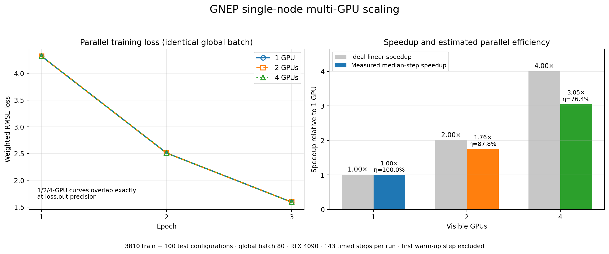

<div align="left">

</div>

# `GNEP`

Copyright (2025) Hongfu Huang.
This is the GPUMD potential extension package GNEP (Gradient-optimized Neuroevolution Potential).
This software is distributed under the GNU General Public License (GPL) version 3.

## Prerequisites

* You need to have a GPU card with compute capability no less than 3.5, a `CUDA` toolkit no older than `CUDA` 9.0 and A compiler that supports `C++14`.
* Works for both Linux (with GCC) and Windows (with MSVC) operating systems. 

## Compile
* Go to the `src` directory and type `make gnep`.
* The `gnep` executable will be generated in the `src` directory. The `gpumd`
  and `nep` targets can be built separately when needed.

## Run
Go to the directory containing `gnep.in` and the training data, then select the
GPU devices with `CUDA_VISIBLE_DEVICES`:

```bash
CUDA_VISIBLE_DEVICES=0 path/to/gnep
CUDA_VISIBLE_DEVICES=0,1 path/to/gnep
CUDA_VISIBLE_DEVICES=0,1,2,3 path/to/gnep
```

GNEP uses all useful visible GPUs on one node. Device 0 means the first logical
device after applying `CUDA_VISIBLE_DEVICES`; it does not need to be physical
GPU 0.

## How to use?
### input file `gnep.in`
```bash
prediction          0
output_descriptor   2
type                2 Ge Se
cutoff              7 5
n_max               10 8
l_max               4     # only 3-body：max 8
basis_size          8 8
neuron              70
#energy_shift       1
#lambda_e           1.0          
#lambda_f           2.0        
#lambda_v           0.1
#weight_decay       0.0001  # Applicable to AdamW
#start_lr           0.001
#stop_lr            0.0000001
#lr_cos_restart     1 1 10 2.0 0.8   # minimal: lr_cos_restart 1
batch               4     # global batch size across all visible GPUs
epoch               400
seed                20260831  # optional reproducible initialization and shuffle

```

## Global batch size and multi-GPU efficiency

`batch` is the number of complete configurations used by one global Adam
update across all visible GPUs. It is **not** a per-GPU batch size. A
configuration is assigned to exactly one GPU and its atoms and neighbor graph
are never split between devices.

The number of GPUs doing useful work in one step is:

```text
active GPUs = min(visible GPUs, configurations in the current global batch)
```

Therefore:

* `batch 1` is valid and trains correctly, but only one GPU is active per step.
* For two GPUs, use a global batch of at least 2 to make both GPUs useful.
* For four GPUs, use a global batch of at least 4 to make all four GPUs useful.
* A final incomplete batch can activate fewer GPUs.
* `batch 4` on four GPUs performs one synchronized update from four
  configurations. It is not the same as four independent `batch 1` updates.

Keep the **same global batch** when comparing one-, two-, and four-GPU speed or
numerical results. For example, use `batch 80` in all three runs rather than
scaling it to 80, 160, and 320. Changing the global batch changes the number of
configurations contributing to each Adam update and can change the training
trajectory.

Very small configurations or a small global batch may be slower on multiple
GPUs because host threads, gradient reduction, and synchronization cost more
than the useful GPU calculation. Choose a batch large enough to provide useful
work per device, while respecting GPU memory and the desired optimization
behavior. Exclude the first warm-up step when benchmarking.

The following validation result is an example, not a performance guarantee. It
used 3810 training configurations, 100 test configurations, the same global
`batch 80`, and RTX 4090 GPUs:

| Visible GPUs | Median step time | Speedup vs. 1 GPU | Peak memory per GPU |
|---:|---:|---:|---:|
| 1 | 0.462856 s | 1.00x | 21582 MiB |
| 2 | 0.263450 s | 1.76x | 11388 / 11246 MiB |
| 4 | 0.151553 s | 3.05x | 6290 / 6068 / 6068 / 6074 MiB |

The estimated parallel efficiency is `eta = speedup / visible GPUs`: 87.8% for
two GPUs and 76.4% for four GPUs in this workload. The left panel below shows
that changing only the number of visible GPUs does not change the serialized
Loss trajectory; the right panel compares measured and ideal linear speedup.



The one-, two-, and four-GPU runs produced identical serialized loss and RMSE
trajectories. Their final model and restart values differed by at most
`6e-8`, which is floating-point reduction noise.

## GPUMD & NEP Manual
Some similar parameter settings and explanations can be found in the GPUMD manual:
* Latest released version: https://gpumd.org/

## References

[Huang2026] Hongfu Huang, Junhao Peng, Kaiqi Li, Jian Zhou, Zhimei Sun, [Efficient GPU-accelerated training of a neuroevolution potential with analytical gradients](https://doi.org/10.1016/j.cpc.2025.109994),
Computer Physics Communications **320**, 109994 (2026).
